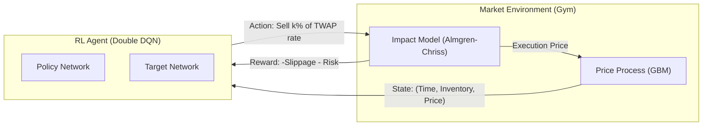

# Deep Reinforcement Learning for Order Execution

This project implements a Deep Q-Network (DQN) agent designed to execute large financial trade orders optimally. The agent learns to balance the trade-off between **market impact** (slippage caused by trading too fast) and **market risk** (price volatility risk from holding inventory too long), targeting a superior **Implementation Shortfall (IS)** compared to standard TWAP strategies.

## Approach & Logic

### The Problem: Optimal Execution

A trader needs to sell a large block of shares (e.g., 10,000) within a fixed time window (e.g., 1 hour).

- **Selling too fast** (dumping) crashes the price due to temporary market impact (liquidity consumption).

- **Selling too slow** exposes the portfolio to price volatility risk; the price might drift down naturally before the trade completes.

### The Solution: Adaptive Control

Standard algorithms like **TWAP** (Time-Weighted Average Price) sell at a constant rate, ignoring market conditions. Our **RL Agent** is adaptive:

- If the price is **rising**, it may accelerate selling to lock in favorable prices ("front-loading").

- If the price is **falling** (but not crashing), it may slow down to wait for mean reversion, provided enough time remains.

## System Architecture

The system models the interaction between an **Execution Agent** (Trader) and a **Simulated Market**.



1. **State Observation:** The agent observes normalized time remaining ($t/T$), inventory remaining ($q/Q$), and recent price returns.

2. **Action Selection:** The agent selects a discrete execution speed (e.g., $0.5\times$, $1.0\times$, $2.0\times$ the baseline TWAP rate).

3. **Market Response:** The environment calculates the execution price (penalized by impact) and evolves the "fair" mid-price for the next step.

## Mathematical Model

### 1. Market Dynamics (Asset Price)

The "fair" mid-price $P_t$ evolves according to **Geometric Brownian Motion (GBM)**, consistent with the Black-Scholes assumption for short time horizons:

$$ dP_t = \mu P_t dt + \sigma P_t dW_t $$

- $\mu$ (Drift): Assumed to be 0 (random walk).

- $\sigma$ (Volatility): Controls the "risk" component. Higher volatility forces the agent to sell faster to avoid uncertainty.

### 2. Transaction Cost (Slippage)

We follow the **Almgren-Chriss** model logic where trading creates a temporary distortion in price. If we sell $n_t$ shares at time $t$:

$$ \tilde{P}t = P_t - \underbrace{\beta \cdot n_t}_{\text{Temporary Impact}} $$

- $\beta$: The liquidity coefficient.

- **Consequence:** The cost of trading is proportional to $n_t^2$. This quadratic cost creates a strong mathematical incentive to split orders into smaller chunks (the foundation of TWAP).

### 3. Reward Function

To train the RL agent, we define a reward $r_t$ that aligns with minimizing Implementation Shortfall (IS):

$$ r_t = \underbrace{(n_t \times \tilde{P}t)}_{\text{Revenue}} - \underbrace{\lambda \frac{q_t^2}{Q}}_{\text{Inventory Penalty}} $$

This is equivalent to minimizing the cost function:

$$ \text{Cost} \approx \sum (\text{Slippage}_t + \text{Risk}_t) $$

- **Slippage Term:** Penalizes trading too fast.

- **Risk Term ($\lambda$):** Penalizes holding inventory too long. If $\lambda=0$, the agent approaches TWAP. If $\lambda$ is high, the agent sells ASAP.

## Project Structure

```
rl-order-execution/
├── .github/workflows/
│   ├── changelog.yaml        # Auto-generate CHANGELOG.md
│   ├── ci.yaml               # CI pipeline (Lint, Test, Type-Check)
│   └── update-docs.yaml      # Auto-update README config table
├── config/
│   └── config.yaml          # Runtime configuration parameters
├── src/
│   └── rl_order_execution/
│       ├── agent.py         # DQN Agent & ReplayBuffer implementation
│       ├── settings.py      # Pydantic configuration & validation
│       ├── environment.py   # Custom Gymnasium Market Environment
│       ├── evaluation.py    # TWAP comparison & plotting logic
│       ├── optimize.py      # Optuna hyperparameter tuning script
│       └── training.py      # Core training loop with TensorBoard
├── tests/                   # Pytest suite
├── output/                  # Generated artifacts
├── db/                      # Optuna SQLite database storage
├── .pre-commit-config.yaml  # Git hooks configuration
├── CHANGELOG.md         # Auto-generated changelog history
├── cliff.toml               # Changelog configuration
├── Dockerfile               # Container definition
├── LICENSE                  # MIT License
├── Makefile                 # Automation commands
├── pyproject.toml           # Dependencies (uv)
├── README.md                # Documentation
└── main.py                  # Application entry point
```

## Getting Started

### Prerequisites

- Python 3.11+
- [uv](https://docs.astral.sh/uv/) (Highly Recommended for dependency resolution)
- [Docker](https://www.docker.com/) (Optional, for isolated execution)

### Setup

- **Clone the repository:**

    ```bash
    git clone https://github.com/alex-is-busy-coding/rl-order-execution.git
    cd rl-order-execution

    # Install dependencies (production + dev)
    make install-dev

    # Set up Git pre-commit hooks (Optional, but recommended)
    make setup-hooks
    ```

- **Install dependencies and run:**
    ```bash
    make run
    ```

This executes the training loop, compares the agent against a TWAP benchmark, and saves a trajectory plot to `execution_analysis.png`.

### Training Tracking

The training loop automatically logs loss, reward, and epsilon decay to TensorBoard.

```bash
make tensorboard
```

Open http://localhost:6006 to view the metrics.

### Hyperparameter Tuning (Optuna)

We use [Optuna](https://optuna.org/) to automatically find the best hyperparameters (Learning Rate, Batch Size, Gamma).

Run the Optimizer:

```bash
make optimize
```

#### Key Features:

1. **Optimization:** Runs trials (TPE algorithm) to maximize the agent's improvement over TWAP.

2. **Early Pruning:** Uses a `MedianPruner` to terminate bad trials early (checked every 50 episodes), saving compute.

3. **Persistence:** Studies are saved to a local SQLite database (`db/optuna_study.db`), allowing you to pause and resume optimization.

4. **Configuration:** Search ranges and trial counts are defined in `config/config`.yaml under the optimization section.

5. **Auto-Deployment:** The best parameters are saved to `config/best_params.yaml`. Subsequent make run calls automatically prioritize these values.

### Docker Support

To run the simulation in a completely isolated environment:

- **Build the image:**

    ```bash
    make docker-build
    ```

- **Run the container:** Mounts the local directory to capture output artifacts.

    ```bash
    make docker-run
    ```

## Key Metrics Explained

The simulation output provides several metrics to assess agent performance against the TWAP benchmark:

| Metric | Interpretation | Implementation |
| ------ | -------------- | -------------- |
| Shortfall (IS) | `(Arrival Price * Shares) - Realized Revenue` | The total cost of trading (slippage + missed opportunity). Lower is better.
| Avg Savings | `Avg(TWAP IS) - Avg(Agent IS)` | The average dollar amount saved per episode by using the RL agent. Positive is good.
| Avg Savings (bps) | `(Avg Savings / Order Value) * 10,000` | Savings normalized by trade size. 1 bps = 0.01%. Standard industry metric for execution quality.
| Information Ratio (IR) | `Mean(Savings) / StdDev(Savings)` | Measures risk-adjusted performance. High IR (>0.5) implies consistent outperformance, not just luck.
| Win Rate | `% of episodes where Agent Cost < TWAP Cost` | Consistency of beating the benchmark. Ideally > 50%.
| VaR 95% (Savings) | `5th Percentile of Savings Distribution` | Tail risk. If negative, it means in the worst 5% of cases, the agent underperforms TWAP by this amount.

## Development Workflow

We use `make` to standardize development tasks and ensure code quality. 

| Command             | Description |
| ------------------- | ----------- |
| `make run`          | Run the simulation
| `make optimize`     | Run Optuna hyperparameter tuning
| `make tensorboard`  | Launch TensorBoard server
| `make check`        | *Recommended.* Run all quality checks (lint + type-check + test)
| `make test`         | Run unit tests
| `make lint`         | Check code style
| `make type-check`   | Run static type checking with mypy
| `make format`       | Auto-format code
| `make docs`         | Locally update README config table
| `make install`      | Install base dependencies
| `make install-dev`  | Install all dev dependencies
| `make docker-build` | Build the Docker image
| `make docker-run`   | Run the Docker container
| `make clean`        | Remove virtualenv, caches, and plots

Run `make help` in your terminal to see the full list of available commands.

## Configuration

Configuration is managed via `pydantic-settings`. You can override defaults using environment variables or by editing `config/config.yaml`.

<!-- settings-start -->
### `logging` settings


| Name | Required | Default | Description |
| :--- | :---: | :--- | :--- |
| `RL_LOGGING__LOG_LEVEL` | No | `INFO` | Logging verbosity level.<br><br>**Possible values:**<br>`DEBUG`, `INFO`, `WARNING`, `ERROR`, `CRITICAL` |

### `optimization` settings


| Name | Required | Default | Description |
| :--- | :---: | :--- | :--- |
| `RL_OPTIMIZATION__BATCH_SIZES` | No | `[32, 64, 128]` | List of batch sizes to test. |
| `RL_OPTIMIZATION__GAMMA_MAX` | No | `0.9999` | Maximum discount factor. |
| `RL_OPTIMIZATION__GAMMA_MIN` | No | `0.9` | Minimum discount factor. |
| `RL_OPTIMIZATION__LR_MAX` | No | `0.01` | Maximum learning rate to test. |
| `RL_OPTIMIZATION__LR_MIN` | No | `1e-05` | Minimum learning rate to test. |
| `RL_OPTIMIZATION__N_TRIALS` | No | `20` | Number of Optuna trials to run. |
| `RL_OPTIMIZATION__STUDY_NAME` | No | `rl_order_execution_v1` | Name of the Optuna study. Change this to start a new experiment. |
| `RL_OPTIMIZATION__TUNING_EPISODES` | No | `500` | Episodes per trial (shorter than production run). |

### `rl` settings


| Name | Required | Default | Description |
| :--- | :---: | :--- | :--- |
| `RL_RL__BATCH_SIZE` | No | `64` | Training batch size. |
| `RL_RL__EPISODES` | No | `500` | Total training episodes. |
| `RL_RL__EPSILON_DECAY` | No | `0.995` | Epsilon decay factor. |
| `RL_RL__EPSILON_END` | No | `0.01` | Minimum exploration rate. |
| `RL_RL__EPSILON_START` | No | `1.0` | Initial exploration rate. |
| `RL_RL__GAMMA` | No | `0.99` | Discount factor. |
| `RL_RL__LR` | No | `0.001` | Learning rate. |
| `RL_RL__MEMORY_SIZE` | No | `10000` | Replay buffer size. |
| `RL_RL__TARGET_UPDATE` | No | `10` | Episodes between target updates. |

### `simulation` settings


| Name | Required | Default | Description |
| :--- | :---: | :--- | :--- |
| `RL_SIMULATION__ACTION_MULTIPLIERS` | No | `[0.0, 0.5, 1.0, 1.5, 2.0, 3.0, 5.0]` | Discrete multipliers of the average execution rate. |
| `RL_SIMULATION__DRIFT` | No | `0.0` | Price drift (mu). |
| `RL_SIMULATION__LIQUIDITY_PARAM` | No | `0.01` | Permanent market impact (alpha). |
| `RL_SIMULATION__SEED` | No | `42` | Random seed for reproducibility. |
| `RL_SIMULATION__START_PRICE` | No | `100.0` | Initial market price. |
| `RL_SIMULATION__TEMP_IMPACT_PARAM` | No | `0.05` | Temporary market impact (beta). |
| `RL_SIMULATION__TIME_HORIZON` | No | `50` | Total duration (time steps). |
| `RL_SIMULATION__TOTAL_SHARES` | No | `1000` | Total number of shares to liquidate. |
| `RL_SIMULATION__VOLATILITY` | No | `0.002` | Price volatility (sigma). |
<!-- settings-end -->

## Limitations & Future Improvements

While this project demonstrates a robust RL pipeline, it makes certain simplifying assumptions common in initial research but limiting for production deployment.

### 1. Discrete vs. Continuous Control (DQN vs. PPO/SAC)

**Limitation:** The current agent uses a Deep Q-Network (DQN), which necessitates a discrete action space. Execution rates are quantized into specific bins (e.g., 0.5x, 1.0x, 2.0x TWAP). This lacks the granularity required for precise optimal control.

**Future Improvement:** Implement **Proximal Policy Optimization (PPO)** or **Soft Actor-Critic (SAC)**. These algorithms natively support continuous action spaces, allowing the agent to output precise float values for execution rates.

### 2. Market Simulation Realism (GBM vs. Stylized Facts)

**Limitation:** The environment utilizes Geometric Brownian Motion (GBM). While standard for theoretical derivatives pricing, GBM fails to capture the "stylized facts" of high-frequency market data, specifically **Volatility Clustering**, **Fat Tails**, and **Mean Reversion**.

**Future Improvement:**

- Implement an **Ornstein-Uhlenbeck (OU)** process to simulate mean-reverting price dynamics.

- Develop a `HistoricalReplayEnv` to train agents on real minute-bar or tick-level data (L2/L3) to validate performance on historical scenarios.

### 3. State Space Complexity

**Limitation:** The current state observation includes only normalized time, inventory, and recent price trend.

Future Improvement: Enrich the state space with microstructure signals such as **Order Book Imbalance (OBI)**, **Volume Weighted Average Price (VWAP) deviation**, and **Bid-Ask Spread** to give the agent deeper market visibility.

## Changelog

See [CHANGELOG.md](CHANGELOG.md) for a history of changes to this project.

## License

This project is licensed under the MIT License. 

See the [LICENSE](LICENSE) file for details.